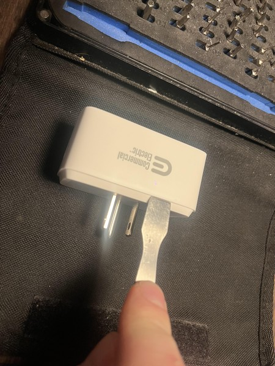
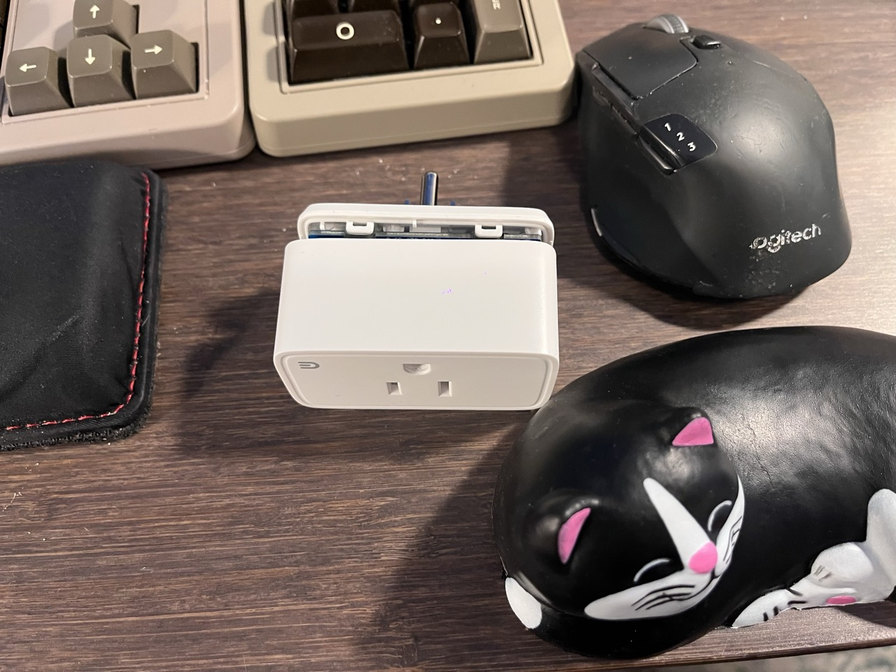
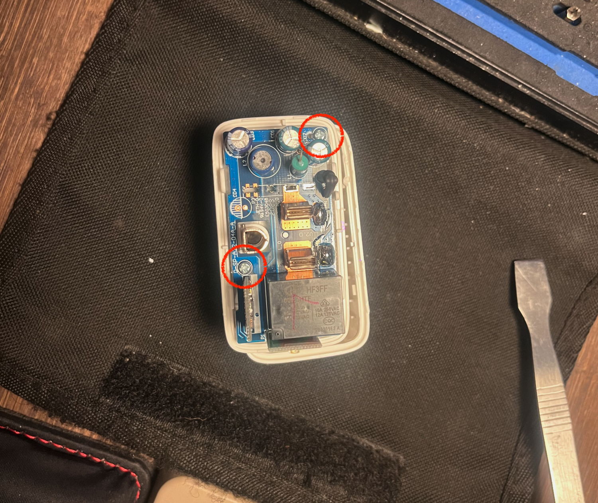

The CE SP1 is quite easy to pry open using a metal spudger. 

The case is held together with 4 plastic clips built in to the housing. 
By carefully prying between the upper and lower part of the case, I was able to separate the two parts without breaking the clips (essential for re-assembly).

There are 2 metal philips head screws to remove, connecting the enclosure to the main circuit board (size 0):
