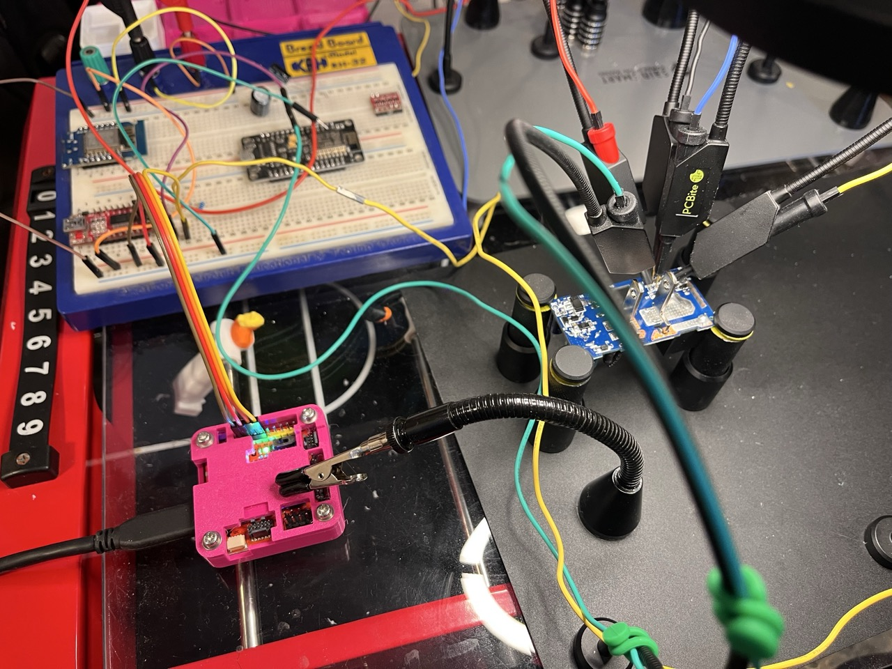
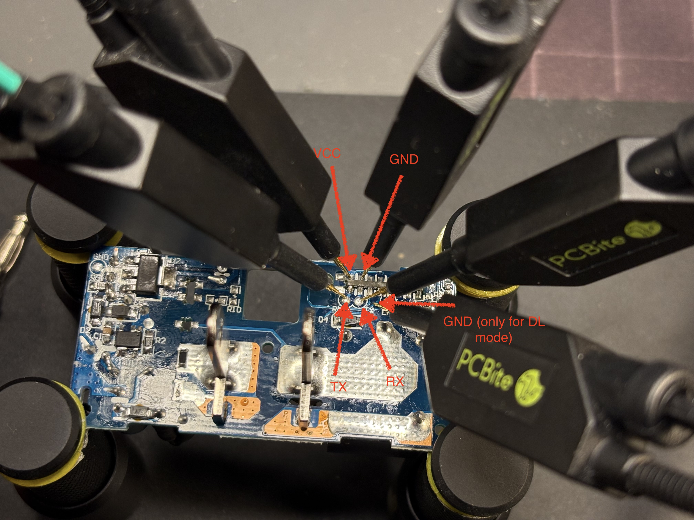

Connect the device to a UART device as follows:

| Tigard | RTL8710BX |
| - | - |
| VTGT | VCC |
| GND | GND |
| RX | TX0 |
| TX | RX0 |

It is first required to put the microcontroller in download mode to enable flashing/dumping the device, which can be accomplished by powering up the device with TX0 connected to GND. This was easy work with the POGO pins on the PCBite, and after downloading ltchiptool in a virtual environment and connecting up the board (with TX0 pulled low for ~3 seconds to enable download mode) the current firmware was dumped:

python3 -m venv .
source bin/activate
pip install ltchiptool zeroconf
ltchiptool flash read realtek-ambz flash-backup.bin

With a serial connection up and running, it was time to create a new firmware to overwrite the OEM version.

ltchiptool flash write cesp1-farm-plug-03.uf2.bin
